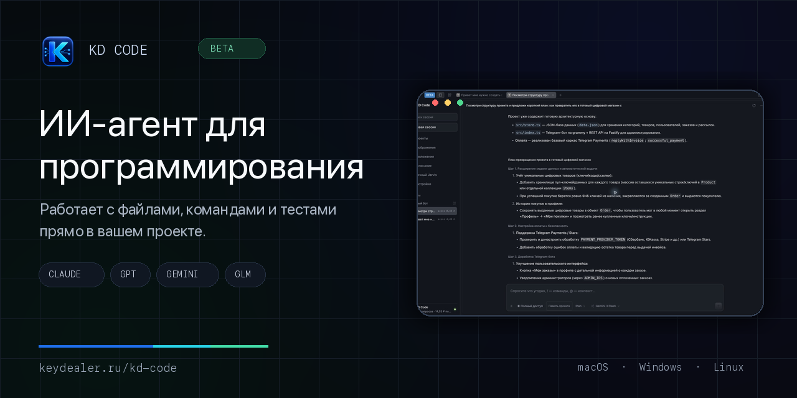
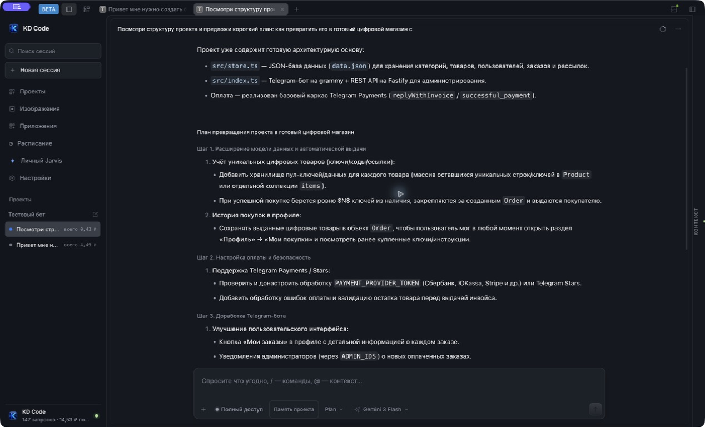
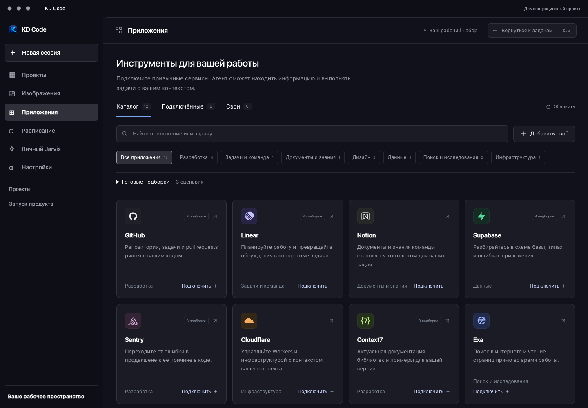
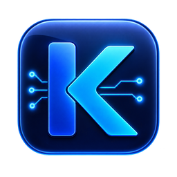

  

<h1 align="center">KD Code — нейросеть для программирования и ИИ-агент для работы с кодом</h1>

  Ставите задачу обычными словами. KD Code изучает проект, меняет файлы, запускает команды и тесты, а стоимость завершённой работы показывает в рублях.

  
  
  

  <strong>macOS Apple Silicon · Windows x64 · Linux x64</strong> 
  <a href="README.en.md">English version</a>

## Ваш проект становится рабочим местом ИИ-агента

KD Code — настольный ИИ-агент для программирования и создания цифровых продуктов. Откройте готовый репозиторий или пустую папку, опишите результат и следите за работой в одном диалоге.

- **Работает с проектом.** Читает разрешённые файлы, предлагает изменения, запускает команды и проверяет результат.
- **Даёт выбирать модель.** Claude, GPT, Gemini, GLM и другие доступные модели работают через один баланс KeyDealer.
- **Показывает расходы.** Фактическое списание и квитанция завершённой работы видны рядом с сессией.
- **Помнит важное.** Вы сами задаёте правила и сведения, которые нужно сохранить между чатами.
- **Подключает рабочие сервисы.** GitHub, Linear, Notion, Supabase, Sentry, Cloudflare и другие приложения доступны из каталога.
- **Выполняет задачи по расписанию.** У каждого запуска есть отдельный чат, выбранная модель и лимит в рублях.
- **Принимает удалённые задачи.** Разрешённый проект можно запустить через Telegram, когда KD Code работает на вашем компьютере.

  

## От задачи до проверенного результата

| 01 · Поставьте задачу | 02 · Следите за работой | 03 · Проверьте итог |
|---|---|---|
| Пишите обычными словами. Готовое техническое задание не требуется. | В диалоге видно, какие файлы изучены, что изменилось и какие команды запущены. | KD Code показывает изменения, результаты тестов и стоимость завершённой работы. |

Подходит для сайтов, Telegram-ботов, личных кабинетов, автоматизации, внутренних инструментов и первых версий онлайн-сервисов.

  <a href="https://keydealer.ru/kd-code#download"><strong>Скачать KD Code и начать работу →</strong></a>

## KD Research быстрее входит в незнакомый проект

Когда агенту нужно разобраться в большой кодовой базе, KD Research помогает быстрее собрать рабочий контекст для задачи. Функция встроена в KD Code и включается во время исследования проекта.

В четырёх парных прогонах одной замороженной read-only задачи с Sonnet 5:

| Стоимость исследования | Оплаченные обращения | Качество ответа |
|---:|---:|---:|
| **−15,33%** | **12 → 9** | **4/4 в обеих группах** |

Сравнивались одинаковые проект, запрос, модель и оценщик. Это результат этапа исследования на конкретной серии, поэтому фактический эффект зависит от проекта, задачи и выбранной модели. [Посмотреть описание и методику →](https://keydealer.ru/kd-code#kd-research)

## Контекст расходуется на работу, а не на повторы

KD Engine внутри приложения управляет длинной историей сессии и повторными результатами инструментов. Полные материалы остаются доступными агенту, а в следующие обращения отправляется компактный рабочий контекст. Размер экономии виден в квитанции и зависит от реального сценария.

Вам не нужно настраивать отдельный proxy, считать токены вручную или переносить проект в новый сервис. Устанавливаете KD Code, подключаете ключ KeyDealer и продолжаете работу в приложении.

## Модели выбираете вы

Один проект можно продолжать на разных моделях без смены приложения. Каталог и доступность обновляются через KeyDealer.

| Семейство | Для чего обычно выбирают |
|---|---|
| **Claude** | Разбор проекта, сложные изменения, внимательная работа с требованиями |
| **GPT** | Агентные задачи, разработка и проверка кода |
| **Gemini** | Быстрые рабочие итерации и задачи с большим контекстом |
| **GLM и другие** | Альтернативные маршруты под скорость, стоимость и конкретный сценарий |

Оплата запросов идёт в рублях. Само приложение распространяется бесплатно в beta-канале.

## Приложения рядом с кодом

Подключите нужные сервисы и выдайте им права для конкретного проекта. Агент сможет обратиться к репозиторию, задачам, документации или инфраструктуре во время работы.

  

## Установка KD Code

1. Откройте [страницу загрузки](https://keydealer.ru/kd-code#download).
2. Выберите macOS, Windows или Linux.
3. Выполните показанную команду установки.
4. Подключите ключ KeyDealer и выберите модель.
5. Откройте папку проекта и поставьте первую задачу.

Актуальные системные требования, подписи пакетов и инструкции всегда публикуются на официальной странице загрузки.

  

## Частые вопросы

<strong>Что такое KD Code?</strong>

 
KD Code — настольный ИИ-агент для программирования. Он работает с файлами проекта, может вносить разрешённые изменения, запускать команды и тесты, а затем показывает результат и стоимость работы.

<strong>KD Code — это нейросеть для написания кода?</strong>

 
Это приложение для работы с несколькими ИИ-моделями. Вы выбираете Claude, GPT, Gemini, GLM или другую доступную модель, а KD Code даёт ей рабочее место, инструменты проекта и управление контекстом.

<strong>Можно ли пользоваться Claude и GPT из России?</strong>

 
KD Code подключается к моделям через ключ KeyDealer. Баланс пополняется и учитывается в рублях. Текущую доступность каждой модели нужно проверять в живом каталоге перед запуском задачи.

<strong>KD Code — альтернатива Claude Code, Codex или Cursor?</strong>

 
KD Code относится к той же категории ИИ-инструментов для программирования, но работает как отдельное настольное приложение KeyDealer. В одном интерфейсе можно выбирать доступные модели Claude, GPT, Gemini и GLM, работать с локальным проектом и видеть стоимость запросов в рублях. Конкретный инструмент лучше выбирать по своим задачам, требованиям к модели и рабочему процессу.

<strong>Где находятся файлы проекта?</strong>

 
KD Code работает с выбранной папкой на вашем компьютере. Доступ к файлам и режим изменений задаёт пользователь. Условия обработки запросов выбранной моделью описаны в документации и политике конфиденциальности KeyDealer.

<strong>Сколько стоит KD Code?</strong>

 
Приложение бесплатно. Вы оплачиваете запросы к выбранной модели по тарифам KeyDealer. В сессии видны фактические списания, а квитанция показывает работу механизмов экономии контекста.

<strong>Опубликован ли исходный код KD Engine?</strong>

 
Нет. Этот репозиторий является официальной публичной витриной продукта и не содержит исходный код KD Code или KD Engine.

## Официальные ссылки

- [KD Code: возможности, примеры и загрузка](https://keydealer.ru/kd-code)
- [Документация KeyDealer и KD Code](https://keydealer.ru/docs)
- [Каталог моделей](https://keydealer.ru/models)
- [Личный кабинет](https://keydealer.ru/app)
- [Поддержка](https://keydealer.ru/app/support)
- [Условия использования](https://keydealer.ru/terms)
- [Политика конфиденциальности](https://keydealer.ru/privacy)

---

   
  <strong>KD Code by KeyDealer</strong> 
  ИИ для программирования в вашем проекте.

> **О репозитории.** Здесь опубликованы только рекламные материалы, пользовательские сведения и официальные ссылки KD Code. Исходный код продукта, KD Engine и внутренняя инфраструктура KeyDealer в репозиторий не входят.
